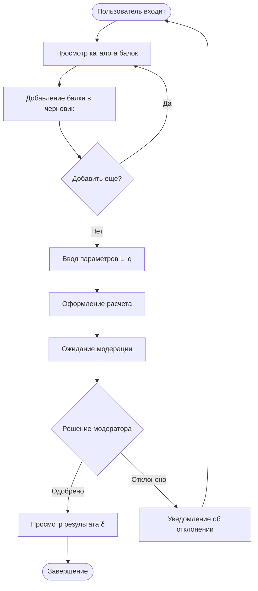

# Beam Deflection Calculator - Техническая документация

## Добро пожаловать

Это комплексная техническая документация для проекта **Beam Deflection Calculator** - веб-приложения на Rails 8 для расчета прогиба балок под нагрузкой.

## О проекте

**Beam Deflection Calculator** - это система для инженерных расчетов прогиба конструктивных балок с функциональностью:
- Каталог типов балок с физическими характеристиками
- Создание расчетов прогиба с заданными параметрами нагрузки
- Система модерации расчетов
- RESTful JSON API с JWT аутентификацией
- Swagger документация

## Технологический стек

### Backend
- **Ruby**: 3.3.9
- **Rails**: 8.0.3
- **Database**: PostgreSQL 15
- **Cache**: Redis 7
- **Storage**: MinIO (S3-compatible)

### Ключевые библиотеки
- **jwt** - JSON Web Token аутентификация
- **bcrypt** - хеширование паролей
- **rswag** - Swagger/OpenAPI документация
- **aws-sdk-s3** - интеграция с MinIO
- **pundit** - авторизация

### DevOps
- **Docker** + **Docker Compose** для оркестрации
- **RSpec** для тестирования
- **RuboCop** для code linting
- **Brakeman** для security scanning

## Структура документации

### 📊 Архитектурная документация

#### [1. Entity-Relationship Diagram (ERD)](architecture/ERD.md)
Схема базы данных с описанием всех сущностей, связей и ограничений.

**Основные сущности**:
- **User** - пользователи системы (обычные + модераторы)
- **Beam** - каталог балок с физическими характеристиками
- **BeamDeflection** - расчеты прогиба с state machine
- **BeamDeflectionBeam** - join-таблица с количеством и результатами

**Темы**:
- Описание полей и типов данных
- Foreign keys и индексы
- Check constraints и валидации
- Формула расчета прогиба

#### [2. State Machine Diagram](architecture/STATE_MACHINE.md)
Жизненный цикл расчетов прогиба с переходами между состояниями.

**Состояния**:
- `draft` → `formed` → `completed` / `rejected`
- `draft` → `deleted`

**Темы**:
- Матрица переходов и авторизация
- Бизнес-логика при переходах
- Валидации и ограничения
- Примеры использования API

#### [3. API Architecture](architecture/API_ARCHITECTURE.md)
Полное описание RESTful JSON API с примерами запросов/ответов.

**Основные endpoints**:
- `/api/auth/*` - регистрация, вход, выход
- `/api/beams` - CRUD балок
- `/api/beam_deflections` - управление расчетами
- `/api/me` - профиль текущего пользователя

**Темы**:
- Swagger документация
- Форматы запросов/ответов
- Коды ошибок
- Примеры curl команд

#### [4. Authentication & Authorization Flow](architecture/AUTH_FLOW.md)
Детальное описание системы безопасности с JWT и Redis blacklist.

**Компоненты**:
- JWT Token Service (кодирование/декодирование)
- JWT Blacklist Service (Redis хранилище)
- Api::BaseController (middleware аутентификации)
- Матрица прав доступа по ролям

**Темы**:
- Sequence diagrams для sign up/in/out
- Архитектура безопасности
- Best practices
- Troubleshooting

#### [5. Docker Architecture](architecture/DOCKER_ARCHITECTURE.md)
Инфраструктура Docker Compose с 4 сервисами.

**Сервисы**:
- **web** - Rails приложение (Puma)
- **db** - PostgreSQL 15
- **redis** - Redis 7 (AOF persistence)
- **minio** - MinIO S3 (хранилище изображений)

**Темы**:
- Конфигурация docker-compose.yml
- Volumes и networking
- Development workflow
- Production considerations
- Troubleshooting

---

## Быстрый старт

### Требования

- Docker Desktop / Docker Engine
- Docker Compose v2+
- Git

### Установка

```bash
# 1. Клонировать репозиторий
git clone <repository-url>
cd exciting-greider

# 2. Создать .env файл (см. .env.example)
cp .env.example .env

# 3. Запустить все сервисы
docker-compose up

# 4. В новом терминале: выполнить миграции
docker-compose exec web bin/rails db:create db:migrate

# 5. (Опционально) Загрузить seed данные
docker-compose exec web bin/rails db:seed
```

### Проверка работы

```bash
# Открыть в браузере:
http://localhost:3000         # Web UI
http://localhost:3000/api-docs # Swagger UI
http://localhost:9001         # MinIO Console

# Health check
curl http://localhost:3000/up
```

---

## Архитектурные решения

### 1. JWT с Redis Blacklist

**Решение**: Комбинация stateless JWT с stateful blacklist для безопасного logout.

**Преимущества**:
- Быстрая аутентификация (без обращения к БД на каждый запрос)
- Мгновенная инвалидация токенов при logout
- Автоматическая очистка через Redis TTL

**Альтернативы**:
- ❌ Session-based auth - не масштабируется для API
- ❌ Pure JWT - невозможен logout до истечения токена
- ❌ OAuth 2.0 - излишне сложно для данного случая

### 2. State Machine для BeamDeflection

**Решение**: Явный state machine с валидацией переходов и ролевой авторизацией.

**Преимущества**:
- Понятный жизненный цикл заявок
- Невозможность invalid transitions
- Audit trail через timestamps (formed_at, completed_at)

**Альтернативы**:
- ❌ Boolean flags (is_draft, is_completed) - хаотично, возможны invalid states
- ❌ AASM gem - избыточно для 5 состояний

### 3. MinIO для хранения изображений

**Решение**: S3-compatible MinIO вместо Active Storage.

**Преимущества**:
- Self-hosted (не зависит от внешних сервисов)
- S3 API (легко мигрировать на AWS S3)
- Отдельный сервис (не нагружает Rails)

**Альтернативы**:
- ❌ Active Storage - избыточно (disabled в config/application.rb)
- ❌ Файловая система - не масштабируется, сложность с Docker volumes

### 4. Concerns для Scopes

**Решение**: Вынос scopes и констант в concerns (BeamScopes, BeamDeflectionScopes).

**Преимущества**:
- DRY (избежание дублирования)
- Легче тестировать scopes отдельно
- Уменьшение размера моделей

**Недостатки**:
- Дополнительный файл для поиска логики

---

## Бизнес-логика

### Формула расчета прогиба

Для однопролетной балки с равномерно распределенной нагрузкой:

```
δ = (5 × q × L⁴) / (384 × E × J)

где:
  δ - прогиб в центре балки (мм)
  q - равномерно распределенная нагрузка (Н/м)
  L - длина балки (м)
  E - модуль упругости материала (Па)
  J - момент инерции сечения (м⁴)
```

**Пример**:
```ruby
# Входные данные
length_m = 6.0        # 6 метров
udl_kn_m = 10.5       # 10.5 кН/м
elasticity_gpa = 200  # 200 ГПа (сталь)
inertia_cm4 = 1840    # 1840 см⁴ (двутавр 20)

# Расчет
q = 10.5 * 1000                    # 10500 Н/м
e = 200 * 1e9                      # 2e11 Па
j = 1840 * 1e-8                    # 1.84e-5 м⁴
deflection_m = 5 * q * (6**4) / (384 * e * j)
deflection_mm = deflection_m * 1000  # 12.34 мм
```

### Workflow пользователя



---

## Тестирование

### RSpec Tests

```bash
# Все тесты
docker-compose exec web bundle exec rspec

# Модели
docker-compose exec web bundle exec rspec spec/models/

# API integration (генерирует Swagger)
docker-compose exec web bundle exec rspec spec/integration/

# С coverage
docker-compose exec web bundle exec rspec --format documentation
```

### Swagger Testing

1. Открыть `http://localhost:3000/api-docs`
2. Нажать **Authorize**
3. Получить токен через `/api/auth/sign_in`
4. Ввести: `Bearer <token>`
5. Тестировать endpoints

### Manual Testing

```bash
# Sign up
curl -X POST http://localhost:3000/api/auth/sign_up \
  -H "Content-Type: application/json" \
  -d '{
    "email": "test@example.com",
    "password": "password123",
    "password_confirmation": "password123"
  }'

# Sign in
curl -X POST http://localhost:3000/api/auth/sign_in \
  -H "Content-Type: application/json" \
  -d '{
    "email": "test@example.com",
    "password": "password123"
  }'

# Get profile (with token)
curl http://localhost:3000/api/me \
  -H "Authorization: Bearer <token>"
```

---

## Production Deployment

### Рекомендации

1. **Environment Variables**
   ```bash
   # Генерация нового SECRET_KEY_BASE
   rails secret

   # Использование Docker secrets
   docker secret create db_password /path/to/password
   ```

2. **SSL/TLS**
   ```ruby
   # config/environments/production.rb
   config.force_ssl = true
   ```

3. **Database**
   - Использовать managed PostgreSQL (AWS RDS, Azure Database)
   - Настроить connection pooling
   - Регулярные backups

4. **Redis**
   - Использовать managed Redis (AWS ElastiCache)
   - Настроить persistence (AOF + RDB)
   - Реплики для failover

5. **MinIO**
   - Distributed mode (минимум 4 nodes)
   - Или миграция на AWS S3 / DigitalOcean Spaces

6. **Monitoring**
   - Логирование: Logrotate, ELK stack
   - Метрики: Prometheus + Grafana
   - Alerting: PagerDuty, Opsgenie

7. **Security**
   - Rate limiting (Rack::Attack)
   - WAF (ModSecurity, Cloudflare)
   - Regular security audits (Brakeman, bundler-audit)

---

## Troubleshooting

### Частые проблемы

#### 1. Docker services not starting
```bash
# Проверить логи
docker-compose logs

# Пересобрать контейнеры
docker-compose down
docker-compose build --no-cache
docker-compose up
```

#### 2. Database connection errors
```bash
# Проверить DATABASE_HOST
docker-compose exec web env | grep DATABASE

# Пересоздать БД
docker-compose exec web bin/rails db:drop db:create db:migrate
```

#### 3. JWT token invalid
```bash
# Проверить SECRET_KEY_BASE
docker-compose exec web env | grep SECRET_KEY_BASE

# Очистить Redis blacklist
docker-compose exec redis redis-cli FLUSHDB
```

#### 4. MinIO access denied
```bash
# Создать bucket
aws --endpoint-url http://localhost:9000 \
    s3 mb s3://beam-deflection

# Проверить credentials
docker-compose exec web env | grep MINIO
```

---

## Contributing

### Code Style

```bash
# Run RuboCop
docker-compose exec web bundle exec rubocop

# Auto-fix
docker-compose exec web bundle exec rubocop -A
```

### Git Workflow

```bash
# Create feature branch
git checkout -b feature/my-feature

# Make changes and commit
git add .
git commit -m "Add feature X"

# Push and create PR
git push origin feature/my-feature
```

### Pull Request Checklist

- [ ] Tests pass (`bundle exec rspec`)
- [ ] RuboCop passes (`bundle exec rubocop`)
- [ ] Swagger docs updated (run integration specs)
- [ ] CLAUDE.md updated (if needed)
- [ ] Migration reviewed (if added)

---

## Дополнительные ресурсы

### Внутренние документы

- [CLAUDE.md](../CLAUDE.md) - инструкции для Claude Code
- [README.md](../README.md) - основной README проекта
- [swagger/v1/swagger.yaml](../swagger/v1/swagger.yaml) - OpenAPI спецификация

### Внешние ресурсы

- [Rails Guides](https://guides.rubyonrails.org/)
- [PostgreSQL Documentation](https://www.postgresql.org/docs/)
- [Redis Documentation](https://redis.io/docs/)
- [MinIO Documentation](https://min.io/docs/)
- [JWT.io](https://jwt.io/)
- [Docker Documentation](https://docs.docker.com/)

---

## Контакты и поддержка

**Репозиторий**: [GitHub](https://github.com/your-repo)

**Issues**: [GitHub Issues](https://github.com/your-repo/issues)

---

## Лицензия

Этот проект является учебным. Проверьте файл LICENSE в корне репозитория для деталей.

---

## Changelog

### Version 1.0.0 (2025-01-01)
- Первый релиз с полной документацией
- Архитектурные диаграммы (ERD, State Machine, API, Auth, Docker)
- Swagger/OpenAPI спецификация
- Docker Compose setup
- JWT authentication с Redis blacklist
- MinIO интеграция

---

Документация актуальна на: **2025-12-01**

Последнее обновление: **2025-12-01**
