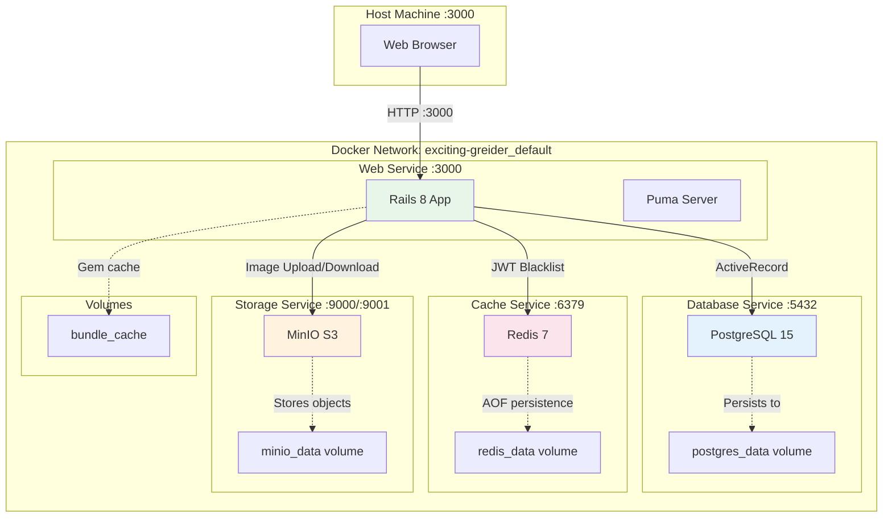
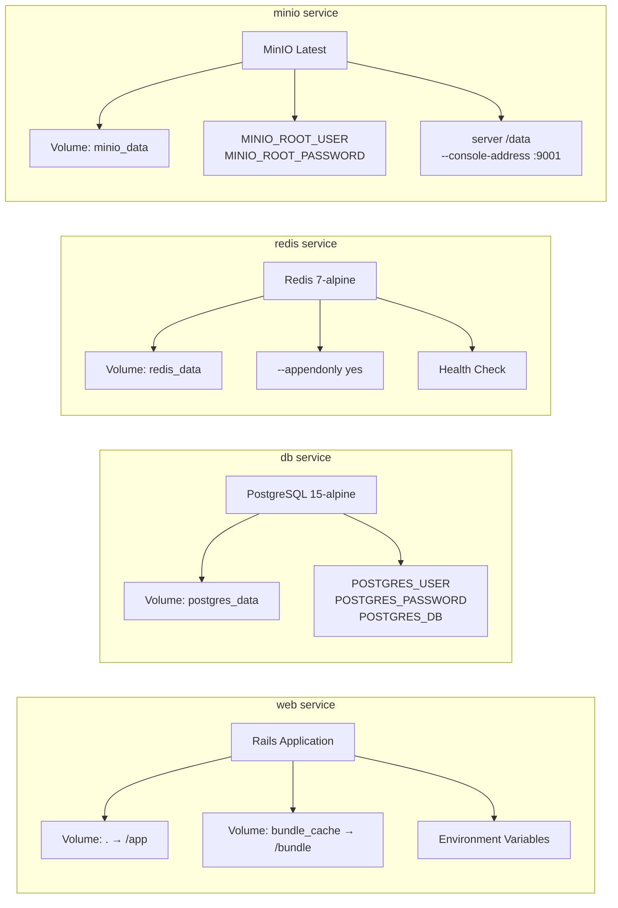
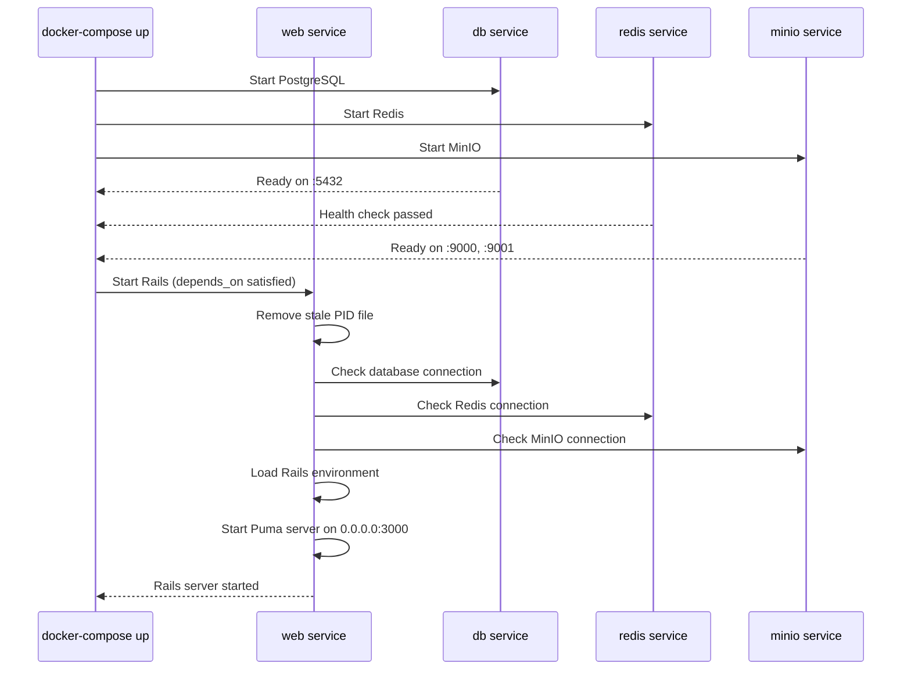

# Docker Architecture

## Обзор инфраструктуры

Приложение использует Docker Compose для оркестрации 4 сервисов:
- **Web** (Rails 8 приложение)
- **PostgreSQL** (база данных)
- **Redis** (JWT blacklist, кеширование)
- **MinIO** (S3-compatible хранилище изображений)

## Архитектурная диаграмма



## Детальная схема сервисов



## docker-compose.yml Анализ

### Полная конфигурация

```yaml
services:
  web:
    build: .
    ports:
      - "3000:3000"
    env_file:
      - .env
    environment:
      - DATABASE_HOST=db
      - REDIS_URL=redis://redis:6379/0
      - RAILS_ENV=development
      - BUNDLE_PATH=/bundle
    depends_on:
      - db
      - redis
      - minio
    volumes:
      - .:/app
      - bundle_cache:/bundle
    command: bash -lc "rm -f tmp/pids/server.pid && bin/rails s -b 0.0.0.0 -p 3000"

  db:
    image: postgres:15-alpine
    environment:
      - POSTGRES_USER=postgres
      - POSTGRES_PASSWORD=postgres
      - POSTGRES_DB=beam_deflection_development
    volumes:
      - postgres_data:/var/lib/postgresql/data
    ports:
      - "5432:5432"

  redis:
    image: redis:7-alpine
    ports:
      - "6379:6379"
    volumes:
      - redis_data:/data
    command: redis-server --appendonly yes
    healthcheck:
      test: ["CMD", "redis-cli", "ping"]
      interval: 5s
      timeout: 3s
      retries: 5

  minio:
    image: minio/minio:latest
    command: server /data --console-address ":9001"
    environment:
      MINIO_ROOT_USER: minio
      MINIO_ROOT_PASSWORD: minio12345
    ports:
      - "9000:9000"   # S3 API endpoint
      - "9001:9001"   # Web console
    volumes:
      - minio_data:/data

volumes:
  minio_data:
  postgres_data:
  redis_data:
  bundle_cache:
```

---

## Сервис: Web (Rails Application)

### Характеристики

| Параметр | Значение |
|----------|----------|
| **Image** | Custom (build: .) |
| **Base** | ruby:3.3.9-alpine |
| **Ports** | 3000:3000 |
| **Working Dir** | /app |
| **Server** | Puma |
| **Dependencies** | db, redis, minio |

### Dockerfile

```dockerfile
FROM ruby:3.3.9-alpine

# Install system dependencies
RUN apk add --no-cache \
    build-base \
    postgresql-dev \
    tzdata \
    bash \
    curl

# Set working directory
WORKDIR /app

# Copy Gemfile and install gems
COPY Gemfile Gemfile.lock ./
RUN bundle install --jobs=4 --retry=3

# Copy application code
COPY . .

# Expose port
EXPOSE 3000

# Start server
CMD ["bash", "-lc", "rm -f tmp/pids/server.pid && bin/rails s -b 0.0.0.0 -p 3000"]
```

### Environment Variables

```bash
# From .env file
DATABASE_HOST=db
DATABASE_NAME=beam_deflection_development
DATABASE_USERNAME=postgres
DATABASE_PASSWORD=postgres

REDIS_URL=redis://redis:6379/0

MINIO_INTERNAL_ENDPOINT=http://minio:9000
MINIO_EXTERNAL_ENDPOINT=http://localhost:9000
MINIO_ACCESS_KEY=minio
MINIO_SECRET_KEY=minio12345
MINIO_BUCKET=beam-deflection

SECRET_KEY_BASE=<your_secret_key>

RAILS_ENV=development
BUNDLE_PATH=/bundle
```

### Volumes

1. **Source Code Mount** (`.:/app`)
   - Тип: bind mount
   - Назначение: hot-reload при разработке
   - Содержимое: весь исходный код приложения

2. **Gem Cache** (`bundle_cache:/bundle`)
   - Тип: named volume
   - Назначение: кеширование установленных gem'ов
   - Преимущество: быстрый rebuild контейнеров

### Startup Process



### Health Checks

**Endpoint**: `GET /up` (Rails health check)

```bash
curl http://localhost:3000/up
# Response: 200 OK (if healthy)
```

---

## Сервис: PostgreSQL

### Характеристики

| Параметр | Значение |
|----------|----------|
| **Image** | postgres:15-alpine |
| **Ports** | 5432:5432 |
| **Database** | beam_deflection_development |
| **Persistence** | postgres_data volume |

### Database Schema

```
beam_deflection_development
├── users
├── beams
├── beam_deflections
└── beam_deflections_beams
```

### Connection Details

**Internal (from web service)**:
```yaml
host: db
port: 5432
database: beam_deflection_development
username: postgres
password: postgres
```

**External (from host machine)**:
```bash
psql -h localhost -p 5432 -U postgres -d beam_deflection_development
```

### Volume Structure

```
postgres_data/
├── base/          # Database files
├── global/        # Cluster-wide tables
├── pg_wal/        # Write-Ahead Log
├── pg_stat/       # Statistics
└── pg_tblspc/     # Tablespaces
```

### Backup & Restore

**Backup**:
```bash
docker-compose exec db pg_dump -U postgres beam_deflection_development > backup.sql
```

**Restore**:
```bash
docker-compose exec -T db psql -U postgres beam_deflection_development < backup.sql
```

---

## Сервис: Redis

### Характеристики

| Параметр | Значение |
|----------|----------|
| **Image** | redis:7-alpine |
| **Ports** | 6379:6379 |
| **Persistence** | AOF (Append-Only File) |
| **Volume** | redis_data |

### Purpose in Application

1. **JWT Blacklist**
   - Key pattern: `jwt:blacklist:<token_hash>`
   - TTL: равен времени до истечения токена
   - Structure: String ("1")

2. **Future: Cache** (не реализовано)
   - Fragment caching
   - Session store
   - Rate limiting counters

### AOF Configuration

```bash
# Command: redis-server --appendonly yes

# Benefits:
# - Durability: every write is logged
# - Crash safety: auto-recovery on restart
# - Replication: AOF can be replayed
```

### Health Check

```yaml
healthcheck:
  test: ["CMD", "redis-cli", "ping"]
  interval: 5s
  timeout: 3s
  retries: 5
```

**Manual Check**:
```bash
docker-compose exec redis redis-cli ping
# Response: PONG
```

### Data Inspection

```bash
# Connect to Redis CLI
docker-compose exec redis redis-cli

# List all blacklisted tokens
KEYS jwt:blacklist:*

# Check TTL of a token
TTL jwt:blacklist:abc123...

# Get all keys count
DBSIZE

# Monitor real-time commands
MONITOR
```

---

## Сервис: MinIO

### Характеристики

| Параметр | Значение |
|----------|----------|
| **Image** | minio/minio:latest |
| **Ports** | 9000 (S3 API), 9001 (Console) |
| **Bucket** | beam-deflection |
| **Persistence** | minio_data volume |

### Purpose in Application

**Хранение изображений балок**:
- Путь: `beam-deflection/<image_key>`
- Формат: PNG, JPG
- Доступ: Public read, authenticated write

### Endpoints

**S3 API** (для приложения):
- Internal: `http://minio:9000` (Docker network)
- External: `http://localhost:9000` (browser access)

**Web Console** (для администраторов):
- URL: `http://localhost:9001`
- Username: `minio`
- Password: `minio12345`

### MinIO Helper Methods

```ruby
# app/helpers/minio_helper.rb
module MinioHelper
  def minio_image_url(image_key)
    return nil unless image_key
    "#{ENV['MINIO_EXTERNAL_ENDPOINT']}/#{ENV['MINIO_BUCKET']}/#{image_key}"
  end

  def minio_upload(file, key)
    client = Aws::S3::Client.new(
      endpoint: ENV['MINIO_INTERNAL_ENDPOINT'],
      access_key_id: ENV['MINIO_ACCESS_KEY'],
      secret_access_key: ENV['MINIO_SECRET_KEY'],
      force_path_style: true
    )

    client.put_object(
      bucket: ENV['MINIO_BUCKET'],
      key: key,
      body: file.read
    )
  end

  def minio_delete(key)
    client.delete_object(
      bucket: ENV['MINIO_BUCKET'],
      key: key
    )
  end
end
```

### Bucket Structure

```
beam-deflection/
├── beam_1.png
├── beam_2.jpg
├── beam_5.png
└── ...
```

### Storage Management

**View files via Console**:
1. Open `http://localhost:9001`
2. Login with `minio` / `minio12345`
3. Navigate to `beam-deflection` bucket

**Via AWS CLI**:
```bash
aws --endpoint-url http://localhost:9000 \
    s3 ls s3://beam-deflection/
```

---

## Docker Networking

### Network: exciting-greider_default

**Type**: bridge (default)

**DNS Resolution**:
- `web` → Rails app
- `db` → PostgreSQL
- `redis` → Redis
- `minio` → MinIO

**Example**: Rails подключается к PostgreSQL через `DATABASE_HOST=db`

### Port Mapping

| Service | Internal Port | External Port | Purpose |
|---------|---------------|---------------|---------|
| web | 3000 | 3000 | Rails HTTP server |
| db | 5432 | 5432 | PostgreSQL client connections |
| redis | 6379 | 6379 | Redis CLI/client |
| minio | 9000 | 9000 | S3 API |
| minio | 9001 | 9001 | Web console |

---

## Volumes Management

### Named Volumes

```bash
# List volumes
docker volume ls
# Output:
# exciting-greider_postgres_data
# exciting-greider_redis_data
# exciting-greider_minio_data
# exciting-greider_bundle_cache

# Inspect volume
docker volume inspect exciting-greider_postgres_data

# Remove unused volumes
docker volume prune
```

### Volume Sizes

```bash
# Check disk usage
docker system df -v

# Typical sizes:
# postgres_data: 100-500 MB (depends on data)
# redis_data: 10-50 MB (JWT blacklist)
# minio_data: 1-10 GB (images)
# bundle_cache: 200-400 MB (gems)
```

---

## Development Workflow

### Starting the Application

```bash
# Start all services
docker-compose up

# Start in detached mode
docker-compose up -d

# View logs
docker-compose logs -f

# View logs for specific service
docker-compose logs -f web
```

### Database Operations

```bash
# Run migrations
docker-compose exec web bin/rails db:migrate

# Reset database
docker-compose exec web bin/rails db:drop db:create db:migrate

# Open Rails console
docker-compose exec web bin/rails console

# Open PostgreSQL console
docker-compose exec db psql -U postgres beam_deflection_development
```

### Testing

```bash
# Run all tests
docker-compose exec web bundle exec rspec

# Run specific test file
docker-compose exec web bundle exec rspec spec/models/beam_spec.rb

# Generate Swagger docs
docker-compose exec web bundle exec rspec spec/integration/
```

### Debugging

```bash
# Attach to running container
docker-compose exec web bash

# Check environment variables
docker-compose exec web env | grep DATABASE

# Restart single service
docker-compose restart web

# Check service status
docker-compose ps
```

---

## Production Considerations

### Security

1. **Environment Variables**
   ```yaml
   # Use Docker secrets instead of .env
   secrets:
     db_password:
       external: true
   ```

2. **Network Isolation**
   ```yaml
   # Separate networks for services
   networks:
     frontend:  # Only web exposed
     backend:   # Internal services
   ```

3. **Non-root User**
   ```dockerfile
   USER rails:rails
   ```

4. **Read-only Filesystem**
   ```yaml
   read_only: true
   tmpfs:
     - /tmp
   ```

### Performance

1. **Resource Limits**
   ```yaml
   web:
     deploy:
       resources:
         limits:
           cpus: '2'
           memory: 2G
         reservations:
           cpus: '1'
           memory: 1G
   ```

2. **Health Checks**
   ```yaml
   web:
     healthcheck:
       test: ["CMD", "curl", "-f", "http://localhost:3000/up"]
       interval: 30s
       timeout: 10s
       retries: 3
   ```

3. **Logging**
   ```yaml
   logging:
     driver: "json-file"
     options:
       max-size: "10m"
       max-file: "3"
   ```

### High Availability

1. **Database Replication**
   - Primary-replica setup
   - Automatic failover

2. **Redis Cluster**
   - Multi-master replication
   - Sentinel for monitoring

3. **MinIO Distributed Mode**
   - Multiple nodes
   - Erasure coding

---

## Troubleshooting

### Web Service Won't Start

**Symptoms**: `web` exits immediately

**Solutions**:
```bash
# Check logs
docker-compose logs web

# Common issues:
# 1. Port 3000 already in use
lsof -i :3000
kill -9 <PID>

# 2. Database not ready
docker-compose restart db
docker-compose up web

# 3. Bundle issues
docker-compose exec web bundle install
```

### Database Connection Failed

**Symptoms**: `PG::ConnectionBad`

**Solutions**:
```bash
# Check database is running
docker-compose ps db

# Check connection from web
docker-compose exec web psql -h db -U postgres -d beam_deflection_development

# Verify environment variables
docker-compose exec web env | grep DATABASE
```

### Redis Connection Timeout

**Symptoms**: `Redis::TimeoutError`

**Solutions**:
```bash
# Check Redis health
docker-compose exec redis redis-cli ping

# Check from web service
docker-compose exec web redis-cli -h redis -p 6379 ping

# Restart Redis
docker-compose restart redis
```

### MinIO Access Denied

**Symptoms**: `403 Forbidden` при upload

**Solutions**:
```bash
# Check MinIO credentials
docker-compose exec web env | grep MINIO

# Create bucket manually
aws --endpoint-url http://localhost:9000 \
    s3 mb s3://beam-deflection
```

### Volume Permissions

**Symptoms**: `Permission denied` errors

**Solutions**:
```bash
# Fix ownership (development only)
docker-compose exec web chown -R $(id -u):$(id -g) /app

# Or rebuild with correct UID/GID
docker-compose build --no-cache web
```

---

## Monitoring Commands

### Quick Health Check

```bash
#!/bin/bash
echo "=== Docker Services Status ==="
docker-compose ps

echo -e "\n=== Web Service Health ==="
curl -s http://localhost:3000/up

echo -e "\n=== PostgreSQL Connection ==="
docker-compose exec -T db pg_isready

echo -e "\n=== Redis Health ==="
docker-compose exec -T redis redis-cli ping

echo -e "\n=== MinIO Health ==="
curl -s http://localhost:9000/minio/health/live

echo -e "\n=== Volume Usage ==="
docker system df -v | grep exciting-greider
```

### Resource Usage

```bash
# Monitor container stats
docker stats

# Top processes in web container
docker-compose exec web top

# Disk usage
docker-compose exec web df -h
```
