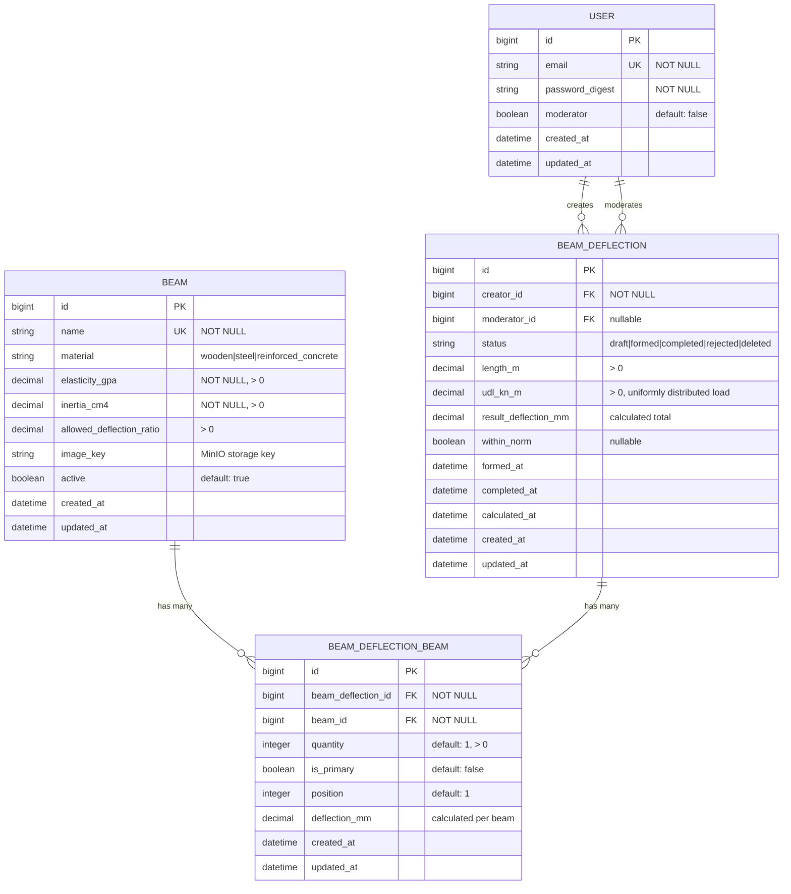

# Entity-Relationship Diagram (ERD)

## Диаграмма базы данных



## Описание сущностей

### USER (Пользователи)
**Таблица**: `users`

Хранит информацию о пользователях системы с двумя ролями:
- **Обычные пользователи**: могут создавать расчеты балок
- **Модераторы** (`moderator=true`): могут одобрять/отклонять заявки

**Ключевые поля**:
- `email` - уникальный идентификатор пользователя
- `password_digest` - bcrypt хеш пароля (через `has_secure_password`)
- `moderator` - флаг прав модератора

**Связи**:
- `has_many :beam_deflections` (as creator) - созданные расчеты
- `has_many :moderated_beam_deflections` (as moderator) - проверенные расчеты

---

### BEAM (Балки)
**Таблица**: `beams`

Справочник типов балок с физическими характеристиками материалов.

**Ключевые поля**:
- `name` - уникальное название балки
- `material` - тип материала (деревянная, стальная, железобетонная)
- `elasticity_gpa` - модуль упругости (ГПа), E
- `inertia_cm4` - момент инерции сечения (см⁴), J
- `allowed_deflection_ratio` - допустимый прогиб (например, L/250)
- `image_key` - ключ изображения в MinIO хранилище
- `active` - флаг мягкого удаления (soft delete)

**Связи**:
- `has_many :beam_deflection_beams` - связь с расчетами через join-таблицу
- `has_many :beam_deflections, through: :beam_deflection_beams`

**Материалы**:
```ruby
MATERIALS = ['wooden', 'steel', 'reinforced_concrete']
```

---

### BEAM_DEFLECTION (Расчеты прогиба)
**Таблица**: `beam_deflections`

Заявки на расчет прогиба балок с жизненным циклом через state machine.

**Статусы** (State Machine):
```ruby
STATUSES = {
  draft: 'draft',           # Черновик (корзина)
  formed: 'formed',         # Оформлен и отправлен модератору
  completed: 'completed',   # Одобрен модератором
  rejected: 'rejected',     # Отклонен модератором
  deleted: 'deleted'        # Удален пользователем
}
```

**Ключевые поля**:
- `creator_id` - создатель расчета (обязательно)
- `moderator_id` - модератор, обработавший заявку (опционально)
- `status` - текущий статус расчета
- `length_m` - длина балки в метрах (L)
- `udl_kn_m` - равномерно распределенная нагрузка, кН/м (q)
- `result_deflection_mm` - итоговый расчетный прогиб в мм (δ)
- `within_norm` - флаг соответствия нормативам

**Временные метки**:
- `formed_at` - когда отправлен модератору
- `completed_at` - когда обработан
- `calculated_at` - когда выполнен расчет

**Связи**:
- `belongs_to :creator` (User)
- `belongs_to :moderator` (User, optional)
- `has_many :beam_deflection_beams`
- `has_many :beams, through: :beam_deflection_beams`

**Бизнес-правила**:
- У каждого пользователя может быть только один draft
- Переходы статусов контролируются `BeamDeflectionStateMachine`

---

### BEAM_DEFLECTION_BEAM (Join-таблица)
**Таблица**: `beam_deflections_beams`

Связь many-to-many между расчетами и балками с дополнительными атрибутами.

**Ключевые поля**:
- `beam_deflection_id` + `beam_id` - составной уникальный ключ
- `quantity` - количество балок данного типа
- `is_primary` - флаг основной балки
- `position` - порядок отображения
- `deflection_mm` - расчетный прогиб для данной балки (δ)

**Связи**:
- `belongs_to :beam_deflection`
- `belongs_to :beam`

**Расчет прогиба** (формула):
```
δ = (5 × q × L⁴) / (384 × E × J)

где:
  L - длина балки (м)
  q - равномерно распределенная нагрузка (Н/м)
  E - модуль упругости (Па)
  J - момент инерции (м⁴)
  δ - прогиб (м), затем конвертируется в мм
```

## Индексы и ограничения

### Уникальные индексы
- `users.email` - UNIQUE
- `beams.name` - UNIQUE
- `beam_deflections_beams(beam_deflection_id, beam_id)` - UNIQUE

### Foreign Keys
- `beam_deflections.creator_id` → `users.id`
- `beam_deflections.moderator_id` → `users.id` (nullable)
- `beam_deflections_beams.beam_deflection_id` → `beam_deflections.id` (cascade delete)
- `beam_deflections_beams.beam_id` → `beams.id` (cascade delete)

### Check constraints
- `beams.elasticity_gpa > 0`
- `beams.inertia_cm4 > 0`
- `beams.allowed_deflection_ratio > 0` (если не NULL)
- `beam_deflections.length_m > 0` (если не NULL)
- `beam_deflections.udl_kn_m > 0` (если не NULL)
- `beam_deflections_beams.quantity > 0`

## Статистика таблиц

| Таблица | Примерный объем | Рост данных |
|---------|----------------|-------------|
| users | Сотни | Медленный |
| beams | Десятки | Редкий |
| beam_deflections | Тысячи | Активный |
| beam_deflections_beams | Десятки тысяч | Активный |
