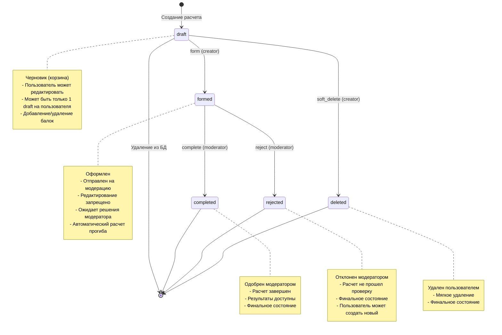

# State Machine для BeamDeflection

## Диаграмма состояний



## Описание состояний

### 1. draft (Черновик)
**Описание**: Начальное состояние для всех новых расчетов. Пользователь формирует "корзину" с балками.

**Характеристики**:
- Один пользователь может иметь только один draft одновременно
- Полная свобода редактирования (добавление/удаление балок, изменение параметров)
- Поля `length_m` и `udl_kn_m` могут быть NULL
- Не требует модератора

**Доступные действия**:
- Добавление балок через `POST /api/beams/:id/add_to_draft`
- Удаление балок через `DELETE /api/beam_deflections/:id/items?beam_id=X`
- Изменение количества через `PUT /api/beam_deflections/:id/items/update_item`
- Обновление параметров через `PUT /api/beam_deflections/:id`

**Переходы**:
- → `formed` через `PUT /api/beam_deflections/:id/form` (только creator)
- → `deleted` через `DELETE /api/beam_deflections/:id` (только creator)

---

### 2. formed (Оформлен)
**Описание**: Расчет отправлен на проверку модератору. Редактирование заблокировано.

**Характеристики**:
- Устанавливается `formed_at` timestamp
- Требует заполнения `length_m` и `udl_kn_m`
- Автоматически вызывается `compute_and_store_result_deflection!`
- Расчет прогиба для каждой балки сохраняется в `deflection_mm`

**Бизнес-логика при переходе**:
```ruby
# BeamDeflectionStateMachine#transition_to('formed')
@beam_deflection.formed_at = Time.current
@beam_deflection.status = 'formed'
@beam_deflection.save!

# Расчет прогиба
@beam_deflection.compute_and_store_result_deflection!
```

**Переходы**:
- → `completed` через `PUT /api/beam_deflections/:id/complete` (только moderator)
- → `rejected` через `PUT /api/beam_deflections/:id/reject` (только moderator)

---

### 3. completed (Одобрен)
**Описание**: Расчет проверен и одобрен модератором. Финальное успешное состояние.

**Характеристики**:
- Устанавливается `completed_at` timestamp
- Записывается `moderator_id`
- Опциональные поля: `result_deflection_mm`, `within_norm`
- Неизменяемое состояние

**Бизнес-логика при переходе**:
```ruby
@beam_deflection.completed_at = Time.current
@beam_deflection.moderator = @user
@beam_deflection.status = 'completed'
@beam_deflection.save!
```

**API endpoint**: `PUT /api/beam_deflections/:id/complete`

---

### 4. rejected (Отклонен)
**Описание**: Расчет отклонен модератором. Финальное состояние с негативным результатом.

**Характеристики**:
- Устанавливается `completed_at` timestamp (время обработки)
- Записывается `moderator_id`
- Неизменяемое состояние
- Пользователь должен создать новый расчет

**Бизнес-логика при переходе**:
```ruby
@beam_deflection.completed_at = Time.current
@beam_deflection.moderator = @user
@beam_deflection.status = 'rejected'
@beam_deflection.save!
```

**API endpoint**: `PUT /api/beam_deflections/:id/reject`

---

### 5. deleted (Удален)
**Описание**: Пользователь удалил черновик. Мягкое удаление (soft delete).

**Характеристики**:
- Доступно только для `draft` статуса
- Запись остается в БД, но исключается из обычных запросов
- Scope `active` исключает deleted записи
- Неизменяемое состояние

**Бизнес-логика**:
```ruby
@beam_deflection.status = 'deleted'
@beam_deflection.save!
```

## Матрица переходов

| Из состояния | В состояние | Актор | Метод API | Валидации |
|-------------|-------------|-------|-----------|-----------|
| draft | formed | creator | `PUT /form` | length_m, udl_kn_m должны быть заполнены |
| draft | deleted | creator | `DELETE /` | - |
| formed | completed | moderator | `PUT /complete` | user.moderator? == true |
| formed | rejected | moderator | `PUT /reject` | user.moderator? == true |

## Авторизация переходов

### BeamDeflectionStateMachine#valid_actor?

```ruby
def valid_actor?(new_status)
  case new_status.to_s
  when 'formed', 'deleted'
    @user == @beam_deflection.creator  # Только создатель
  when 'completed', 'rejected'
    @user.moderator?                   # Только модератор
  else
    false
  end
end
```

## Методы модели для переходов

### Instance methods в BeamDeflection

```ruby
# Проверки прав доступа
def can_form_by?(user)
  creator == user && draft?
end

def can_complete_by?(user)
  user.moderator? && formed?
end

def can_reject_by?(user)
  user.moderator? && formed?
end

# Выполнение переходов
def mark_as_formed!(moderator: nil)
  update!(
    status: 'formed',
    moderator: moderator,
    formed_at: Time.current
  )
end

def complete!(deflection_mm: nil, within_norm: nil)
  update!(
    status: 'completed',
    completed_at: Time.current,
    result_deflection_mm: deflection_mm,
    within_norm: within_norm
  )
  compute_and_store_result_deflection! if deflection_mm.nil?
end

def reject!(moderator:)
  update!(
    status: 'rejected',
    moderator: moderator
  )
end

def soft_delete!
  update!(status: 'deleted')
end
```

## Scopes для запросов

```ruby
# app/models/concerns/beam_deflection_scopes.rb
scope :draft, -> { where(status: 'draft') }
scope :formed, -> { where(status: 'formed') }
scope :completed, -> { where(status: 'completed') }
scope :rejected, -> { where(status: 'rejected') }
scope :deleted, -> { where(status: 'deleted') }

scope :active, -> { where.not(status: ['deleted', 'rejected']) }
scope :draft_for, ->(user) { draft.where(creator: user) }
```

## Бизнес-правила

1. **Один draft на пользователя**
   ```ruby
   validates :base, on: :create do
     if draft? && self.class.draft_for(creator).exists?
       errors.add(:base, 'У пользователя уже есть черновик')
     end
   end
   ```

2. **Обязательные поля при оформлении**
   - `length_m > 0`
   - `udl_kn_m > 0`
   - Хотя бы одна балка в `beam_deflection_beams`

3. **Автоматический расчет**
   - При переходе в `formed` автоматически вызывается расчет прогиба
   - При `complete` можно передать готовый результат или пересчитать

4. **Неизменяемость финальных состояний**
   - `completed`, `rejected`, `deleted` не допускают изменений

## Примеры использования

### Создание и оформление расчета
```ruby
# 1. Создается draft автоматически
deflection = BeamDeflection.ensure_draft_for(user)

# 2. Добавляются балки
deflection.beam_deflection_beams.create!(beam: beam1, quantity: 2)

# 3. Заполняются параметры
deflection.update!(length_m: 6.0, udl_kn_m: 10.5)

# 4. Оформление
state_machine = BeamDeflectionStateMachine.new(deflection, user)
state_machine.transition_to('formed')
```

### Обработка модератором
```ruby
# 1. Модератор получает formed заявки
formed_deflections = BeamDeflection.formed

# 2. Одобрение
state_machine = BeamDeflectionStateMachine.new(deflection, moderator)
state_machine.transition_to('completed', {
  result_deflection_mm: 12.5,
  within_norm: true
})

# 3. Или отклонение
state_machine.transition_to('rejected')
```

## Обработка ошибок

```ruby
def transition_to(new_status, attributes = {})
  return false unless can_transition_to?(new_status)

  @beam_deflection.transaction do
    # ... transition logic
    @beam_deflection.save!
  end

  true
rescue => e
  @beam_deflection.errors.add(:base, "State transition failed: #{e.message}")
  false
end
```

**Типичные ошибки**:
- `401 Unauthorized` - пользователь не авторизован
- `403 Forbidden` - недостаточно прав для перехода
- `422 Unprocessable Entity` - невалидные данные (например, отсутствует length_m)
- `404 Not Found` - расчет не найден

## Мониторинг и метрики

Полезные запросы для аналитики:

```ruby
# Количество по статусам
BeamDeflection.group(:status).count

# Средняя скорость обработки
BeamDeflection.formed.average('completed_at - formed_at')

# Процент одобрения
approved = BeamDeflection.completed.count
rejected = BeamDeflection.rejected.count
approval_rate = approved.to_f / (approved + rejected) * 100

# Активность модераторов
User.where(moderator: true).joins(:moderated_beam_deflections)
  .group('users.email').count
```
