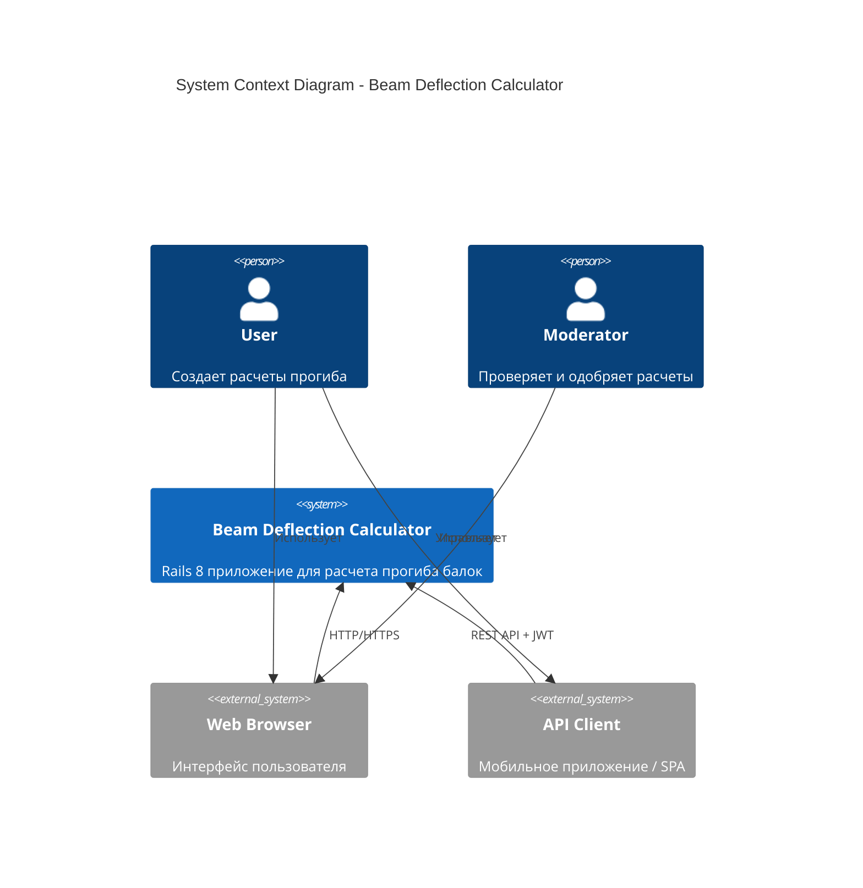
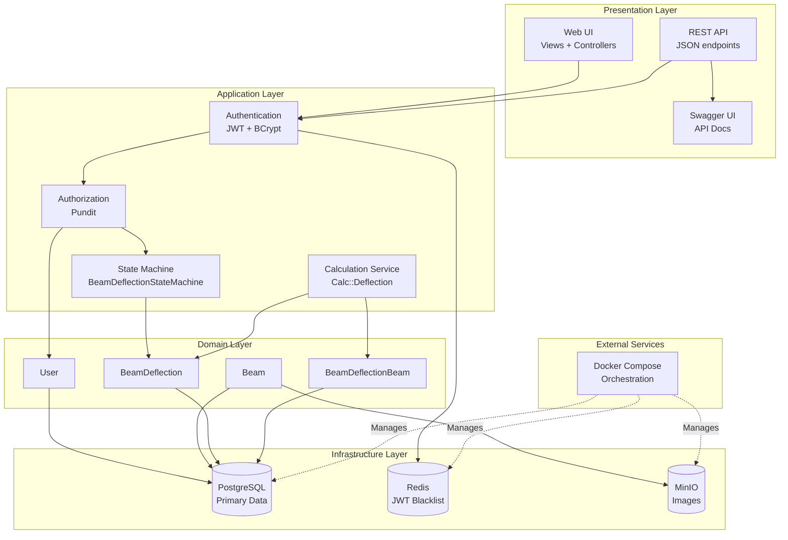
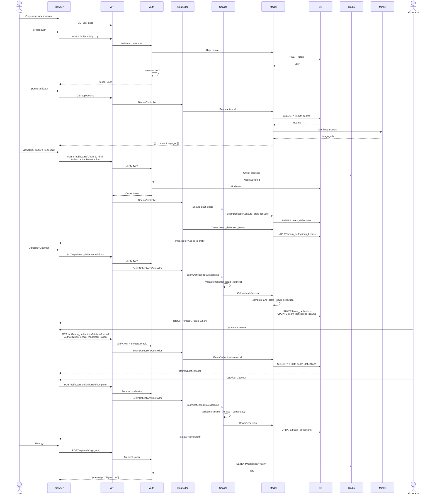
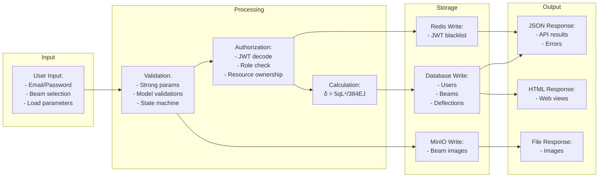
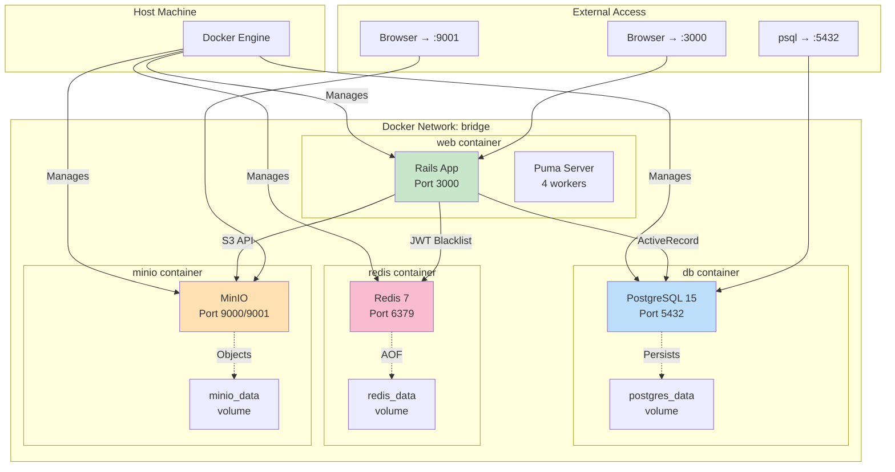
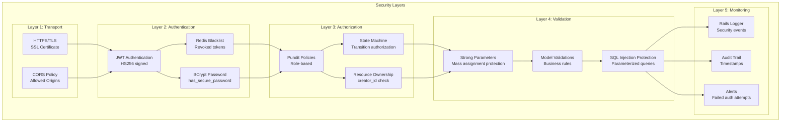
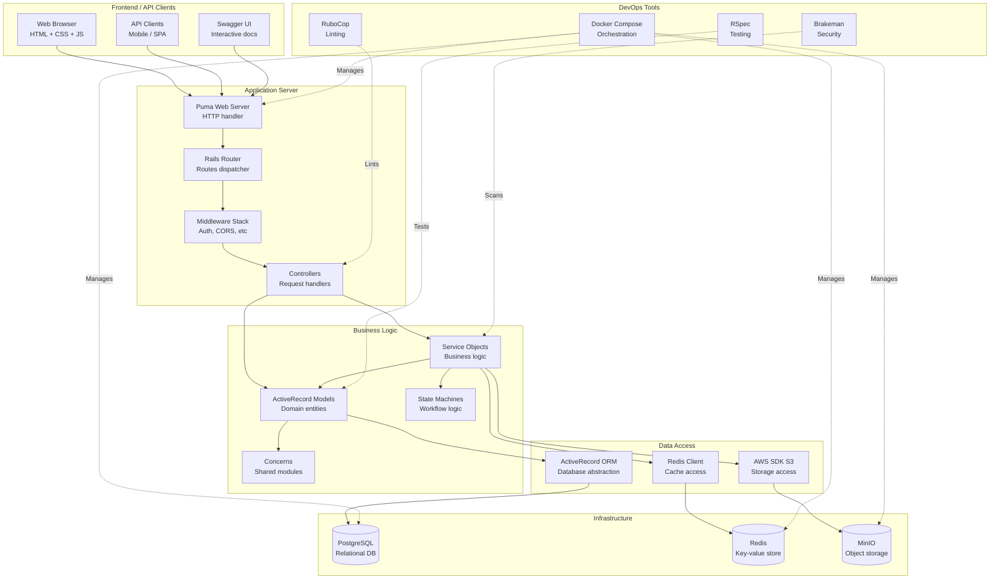
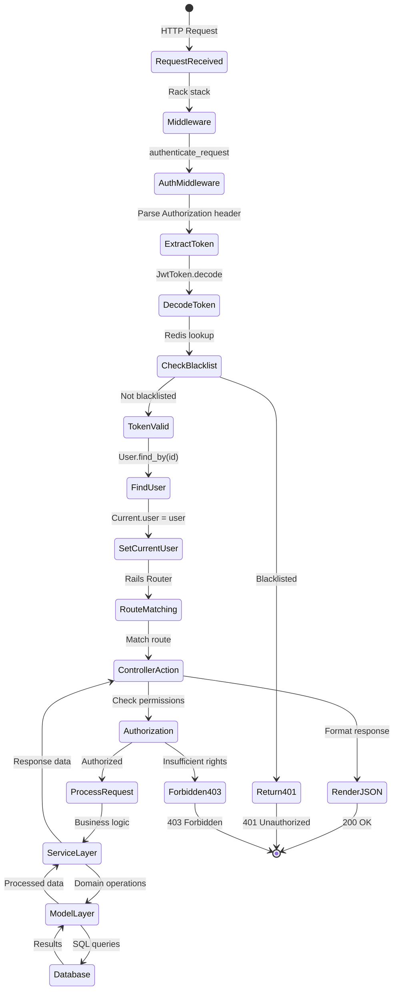
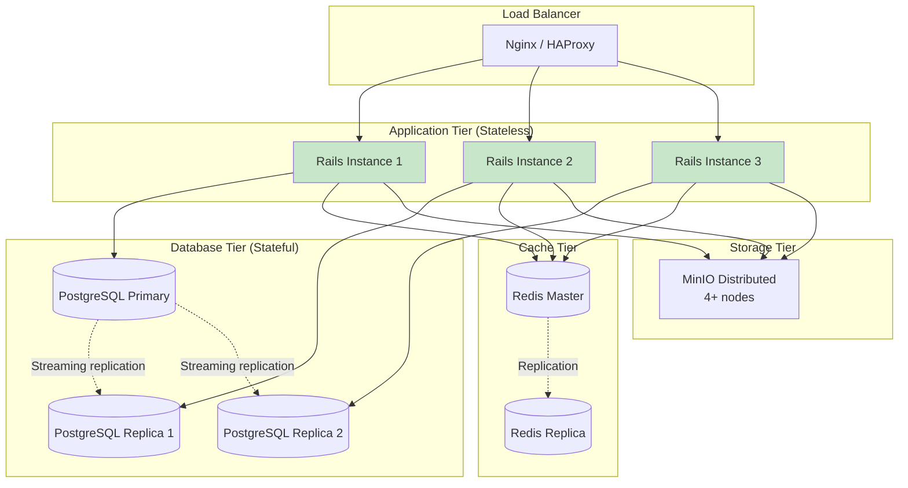
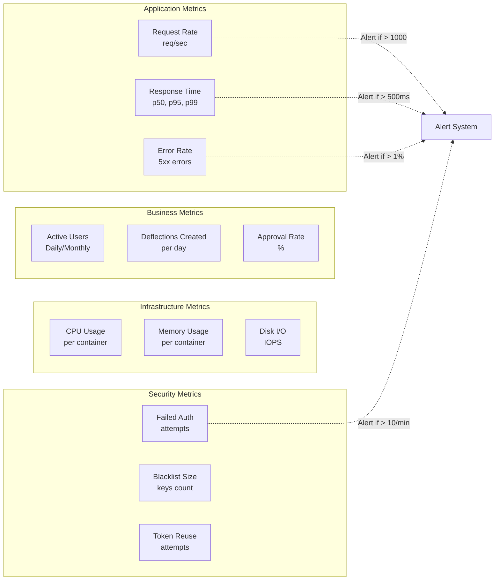

# System Overview - Общая архитектура системы

## Высокоуровневая архитектура

## Компонентная архитектура

## Схема взаимодействия компонентов

## Data Flow Diagram

## Deployment Architecture

## Security Architecture

## Technology Stack Layers

## Request Lifecycle

## Scalability Considerations

### Horizontal Scaling

### Performance Bottlenecks

| Component | Potential Bottleneck | Mitigation |
|-----------|---------------------|------------|
| **Rails App** | Ruby GIL (Global Interpreter Lock) | Use Puma threads, horizontal scaling |
| **PostgreSQL** | Write locks on `beam_deflections` | Read replicas for SELECT, partition large tables |
| **Redis** | Single-threaded nature | Use Redis Cluster for sharding |
| **MinIO** | Network I/O for large images | CDN caching, image optimization |
| **JWT Decode** | CPU-intensive on every request | Redis caching of decoded tokens (short TTL) |

### Monitoring Metrics

## Development vs Production

| Aspect | Development | Production |
|--------|-------------|------------|
| **Environment** | Docker Compose | Kubernetes / ECS |
| **Database** | PostgreSQL (single instance) | PostgreSQL (primary + replicas) |
| **Redis** | Single instance | Redis Cluster / Sentinel |
| **MinIO** | Single container | Distributed mode (4+ nodes) |
| **SSL** | Optional (localhost) | Required (Let's Encrypt) |
| **Secrets** | .env file | Docker secrets / Vault |
| **Logging** | STDOUT | Centralized (ELK, CloudWatch) |
| **Monitoring** | Manual | Prometheus + Grafana |
| **Backups** | Manual pg_dump | Automated (daily + hourly) |
| **CDN** | None | CloudFlare / CloudFront |
| **Rate Limiting** | None | Rack::Attack + WAF |

---

## Glossary

| Term | Definition |
|------|------------|
| **Beam** | Конструктивный элемент (балка) с физическими характеристиками |
| **Deflection** | Прогиб балки под нагрузкой (δ, mm) |
| **UDL** | Uniformly Distributed Load - равномерно распределенная нагрузка (q, kN/m) |
| **Elasticity** | Модуль упругости материала (E, GPa) |
| **Inertia** | Момент инерции сечения балки (J, cm⁴) |
| **State Machine** | Конечный автомат для управления статусами расчета |
| **JWT** | JSON Web Token - токен аутентификации |
| **Blacklist** | Список отозванных токенов в Redis |
| **MinIO** | S3-compatible объектное хранилище |
| **AOF** | Append-Only File - механизм персистентности Redis |

---

## Next Steps

### Immediate Improvements
1. Добавить rate limiting (Rack::Attack)
2. Настроить CORS для production
3. Добавить background jobs (Sidekiq + Redis)
4. Реализовать email notifications (Action Mailer)

### Future Features
1. Расширенные расчеты (точечные нагрузки, многопролетные балки)
2. Графики прогиба (Chart.js)
3. Экспорт результатов (PDF, Excel)
4. История изменений расчета (PaperTrail gem)
5. Комментарии к расчетам
6. Webhooks для интеграций

### Performance Optimizations
1. Fragment caching для списков
2. Database connection pooling
3. Eager loading (N+1 prevention)
4. CDN для статических файлов
5. Gzip compression

---

Эта диаграмма предоставляет полное видение системы на разных уровнях абстракции.
